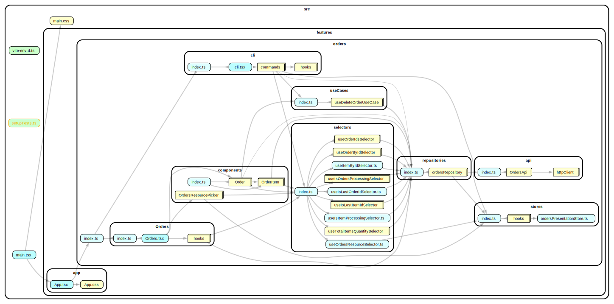

# Frontend Clean Architecture

This repository showcases a frontend application built using the principles of
[Clean Architecture](https://blog.cleancoder.com/uncle-bob/2012/08/13/the-clean-architecture.html).

It demonstrates that applying Clean Architecture in frontend development doesn't
have to lead to unnecessary complexity or over-engineering. Instead, it can
simplify the development process while providing the full benefits of this
architectural style.

## Clean Architecture Implementation

A basic implementation of Clean Architecture for a typical frontend application
with a store and API integration is as follows:


This implementation is framework-agnostic and can be used with any modern
reactive frontend framework, like React, Vue, Svelte, or Angular.

For more context, you can read these articles:

- [Frontend Clean Architecture: Practical Insights and Pitfalls](https://dev.to/harunou/clean-architecture-practical-insights-and-pitfalls-1mdj)
- [Clean Architecture for Frontend Applications](https://dev.to/harunou/clean-architecture-in-frontend-applications-overview-4o89)

### Implementation with TanStack React Query

This application, however, uses TanStack React Query for server state management
and synchronization states, which fits naturally into a repository unit.

The following diagram illustrates an extended Clean Architecture implementation
that includes a repository unit, which this application follows.


- The **Repository unit** is responsible for managing server state, handling
  synchronization, and providing a consistent data interface to the rest of the
  application by compositing Gateway unit and Entities.
- The **Gateway unit** abstracts communication with the API, transforming data
  into a format suitable for the repository. It provides consistent data
  interface for the rest of the application.

## Dependency Graph

Here is the dependency graph:



## File Structure of the Orders Module

```console
./src/features/orders
├── api
│   ├── httpClient
│   │   ├── httpClient.ts
│   │   └── index.ts
│   ├── index.ts
│   ├── OrdersApi
│   │   ├── index.ts
│   │   ├── OrdersApi.factory.ts
│   │   ├── OrdersApi.ts
│   │   └── OrdersApi.types.ts
│   └── types.ts
├── cli
│   ├── cli.tsx
│   ├── commands
│   │   ├── DeleteOrder
│   │   │   ├── DeleteOrder.tsx
│   │   │   ├── DeleteOrder.types.tsx
│   │   │   ├── hooks
│   │   │   │   ├── index.ts
│   │   │   │   ├── useController.ts
│   │   │   │   └── usePresenter.ts
│   │   │   └── index.ts
│   │   ├── index.ts
│   │   ├── PrintAvailableOrderIds.tsx
│   │   ├── PrintOrdersResource.tsx
│   │   └── SwitchOrdersResource.tsx
│   ├── hooks
│   │   └── useConsoleRenderer.ts
│   └── index.ts
├── components
│   ├── index.ts
│   ├── Order
│   │   ├── hooks
│   │   │   ├── index.ts
│   │   │   ├── useController.ts
│   │   │   └── usePresenter
│   │   │       ├── index.ts
│   │   │       ├── usePresenter.spec.ts
│   │   │       └── usePresenter.ts
│   │   ├── index.ts
│   │   ├── Order.tsx
│   │   └── Order.types.ts
│   ├── OrderItem
│   │   ├── hooks
│   │   │   ├── index.ts
│   │   │   ├── useController
│   │   │   │   ├── index.ts
│   │   │   │   ├── useController.spec.tsx
│   │   │   │   └── useController.ts
│   │   │   └── usePresenter.ts
│   │   ├── index.ts
│   │   ├── OrderItem.tsx
│   │   └── OrderItem.types.ts
│   └── OrdersResourcePicker
│       ├── index.ts
│       └── OrdersResourcePicker.tsx
├── index.ts
├── Orders
│   ├── hooks
│   │   ├── index.ts
│   │   ├── useController.ts
│   │   └── usePresenter.ts
│   ├── index.ts
│   ├── integration.spec.tsx
│   ├── Orders.spec.tsx
│   ├── Orders.tsx
│   └── Orders.types.ts
├── repositories
│   ├── index.ts
│   └── ordersRepository
│       ├── hooks.ts
│       ├── index.ts
│       ├── ordersRepositoryKeys.ts
│       ├── ordersRepository.ts
│       ├── ordersRepository.types.ts
│       ├── OrdersService
│       │   ├── index.ts
│       │   ├── InMemoryOrdersService
│       │   │   ├── index.ts
│       │   │   ├── InMemoryOrdersService.spec.ts
│       │   │   ├── InMemoryOrdersService.ts
│       │   │   └── makeMockOrderEntities.ts
│       │   ├── OrdersService.ts
│       │   └── RemoteOrdersService
│       │       ├── index.ts
│       │       ├── mappers.ts
│       │       ├── RemoteOrdersService.spec.ts
│       │       └── RemoteOrdersService.ts
│       └── utils
│           ├── index.ts
│           ├── isOrderItemMutationVariables.ts
│           └── testing
│               ├── index.ts
│               └── makeOrdersServiceMock.ts
├── selectors
│   ├── index.ts
│   ├── useIsItemProcessingSelector.ts
│   ├── useIsLastItemIdSelector
│   │   ├── index.ts
│   │   ├── useIsLastItemIdSelector.spec.ts
│   │   └── useIsLastItemIdSelector.ts
│   ├── useIsLastOrderIdSelector.ts
│   ├── useIsOrdersProcessingSelector
│   │   ├── index.ts
│   │   ├── useIsOrdersProcessingSelector.spec.tsx
│   │   └── useIsOrdersProcessingSelector.ts
│   ├── useItemByIdSelector.ts
│   ├── useOrderByIdSelector
│   │   ├── index.ts
│   │   ├── integration.spec.tsx
│   │   ├── useOrderByIdSelector.spec.tsx
│   │   └── useOrderByIdSelector.ts
│   ├── useOrderIdsSelector
│   │   ├── index.ts
│   │   ├── useOrderIdsSelector.spec.tsx
│   │   └── useOrderIdsSelector.ts
│   ├── useOrdersResourceSelector.ts
│   └── useTotalItemsQuantitySelector
│       ├── index.ts
│       ├── integration.spec.tsx
│       ├── useTotalItemsQuantitySelector.spec.tsx
│       └── useTotalItemsQuantitySelector.ts
├── stores
│   ├── hooks
│   │   ├── index.ts
│   │   └── useOrdersPresentationStore.ts
│   ├── index.ts
│   ├── ordersPresentationStore.ts
│   └── ordersPresentationStore.types.ts
├── testIds.ts
├── types
│   ├── index.ts
│   └── OrdersResource.ts
├── useCases
│   ├── index.ts
│   └── useDeleteOrderUseCase
│       ├── index.ts
│       ├── useDeleteOrderUseCase.spec.tsx
│       └── useDeleteOrderUseCase.ts
└── utils
    ├── index.ts
    └── testing
        ├── index.ts
        ├── itemEntityFactory.ts
        ├── makeComponentFixture.tsx
        ├── makeOrderEntities.ts
        └── orderEntityFactory.ts

39 directories, 109 files
```
