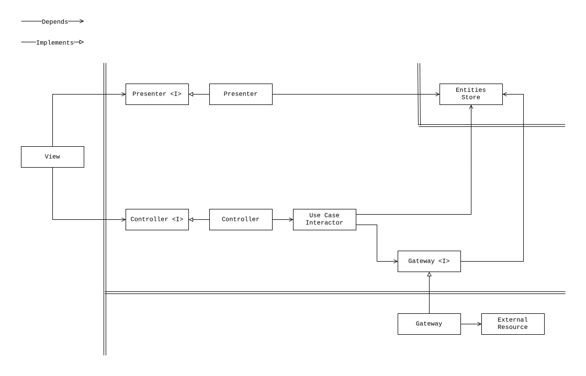

# Frontend Clean Architecture

This repository showcases a frontend application built using the principles of
[Clean Architecture](https://blog.cleancoder.com/uncle-bob/2012/08/13/the-clean-architecture.html).

It demonstrates that applying Clean Architecture in frontend development doesn't
have to lead to unnecessary complexity or over-engineering. Instead, it can
simplify the development process while providing the full benefits of this
architectural style.

For more context, you can read these articles:

- [Frontend Clean Architecture: Practical Insights and Pitfalls](https://dev.to/harunou/clean-architecture-practical-insights-and-pitfalls-1mdj)
- [Clean Architecture for Frontend Applications](https://dev.to/harunou/clean-architecture-in-frontend-applications-overview-4o89)

## Clean Architecture Implementation

A basic implementation of Clean Architecture for a typical frontend application
with a store and API integration is as follows:



This implementation is framework-agnostic and can be used with any modern
reactive frontend framework, like React, Vue, Svelte, or Angular.

This application, however, uses TanStack React Query for server state management
and synchronization states, which fits naturally into a repository unit.

The following diagram illustrates an extended Clean Architecture implementation
that includes a repository unit, which this application follows.


- The **Repository unit** is responsible for managing server state, handling
  synchronization, and providing a consistent data interface to the rest of the
  application.
- The **Gateway unit** abstracts communication with the API, transforming data
  into a format suitable for the repository. Using a gateway is recommended when
  an application deals with multiple API endpoints or stores data in various
  locations (e.g., in-memory, on a server, or in browser storage).

## Dependency Graph

Here is the dependency graph:


## File Structure of the Orders Module

```console
./src/features/orders
├── cli
│   ├── cli.tsx
│   ├── commands
│   │   ├── DeleteOrder
│   │   │   ├── DeleteOrder.tsx
│   │   │   ├── DeleteOrder.types.tsx
│   │   │   ├── hooks
│   │   │   │   ├── index.ts
│   │   │   │   ├── useController.ts
│   │   │   │   └── usePresenter.ts
│   │   │   └── index.ts
│   │   ├── index.ts
│   │   ├── PrintAvailableOrderIds.tsx
│   │   ├── PrintOrdersResource.tsx
│   │   └── SwitchOrdersResource.tsx
│   ├── hooks
│   │   └── useConsoleRenderer.ts
│   └── index.ts
├── externalResources
│   ├── httpClient
│   │   ├── httpClient.ts
│   │   └── index.ts
│   ├── index.ts
│   ├── OrdersApi
│   │   ├── index.ts
│   │   ├── OrdersApi.factory.ts
│   │   ├── OrdersApi.ts
│   │   └── OrdersApi.types.ts
│   └── types.ts
├── index.ts
├── repositories
│   ├── index.ts
│   └── ordersRepository
│       ├── hooks
│       │   ├── index.ts
│       │   ├── useGatewayResource.ts
│       │   └── useOrdersGateway.ts
│       ├── index.ts
│       ├── OrdersGateway
│       │   ├── index.ts
│       │   ├── InMemoryOrdersGateway
│       │   │   ├── index.ts
│       │   │   ├── InMemoryOrdersGateway.spec.ts
│       │   │   └── InMemoryOrdersGateway.ts
│       │   ├── makeOrderEntities.ts
│       │   ├── OrdersGateway.types.ts
│       │   └── RemoteOrdersGateway
│       │       ├── index.ts
│       │       ├── mappers.ts
│       │       ├── RemoteOrdersGateway.spec.ts
│       │       └── RemoteOrdersGateway.ts
│       ├── ordersRepositoryKeys.ts
│       ├── ordersRepository.ts
│       └── ordersRepository.utils.ts
├── selectors
│   ├── index.ts
│   ├── useIsLastItemIdSelector
│   │   ├── index.ts
│   │   ├── useIsLastItemIdSelector.spec.ts
│   │   └── useIsLastItemIdSelector.ts
│   ├── useIsLastOrderIdSelector.ts
│   ├── useIsOrdersProcessingSelector
│   │   ├── index.ts
│   │   ├── useIsOrdersProcessingSelector.spec.tsx
│   │   └── useIsOrdersProcessingSelector.ts
│   ├── useItemByIdSelector.ts
│   ├── useOrderByIdSelector
│   │   ├── index.ts
│   │   ├── integration.spec.tsx
│   │   ├── useOrderByIdSelector.spec.tsx
│   │   └── useOrderByIdSelector.ts
│   ├── useOrderIdsSelector
│   │   ├── index.ts
│   │   ├── useOrderIdsSelector.spec.tsx
│   │   └── useOrderIdsSelector.ts
│   ├── useOrdersResourceSelector.ts
│   └── useTotalItemsQuantitySelector
│       ├── index.ts
│       ├── integration.spec.tsx
│       ├── useTotalItemsQuantitySelector.spec.tsx
│       └── useTotalItemsQuantitySelector.ts
├── stores
│   ├── hooks
│   │   ├── index.ts
│   │   └── useOrdersPresentationStore.ts
│   ├── index.ts
│   └── ordersPresentationStore.ts
├── types
│   ├── entities
│   │   ├── index.ts
│   │   ├── ItemEntity
│   │   │   ├── index.ts
│   │   │   └── ItemEntity.ts
│   │   ├── OrderEntity
│   │   │   ├── index.ts
│   │   │   └── OrderEntity.ts
│   │   └── OrdersPresentationEntity.ts
│   ├── index.ts
│   ├── OrdersResource.ts
│   └── repositories
│       ├── index.ts
│       └── OrdersRepository.ts
├── useCases
│   ├── index.ts
│   └── useDeleteOrderUseCase
│       ├── index.ts
│       ├── useDeleteOrderUseCase.spec.tsx
│       └── useDeleteOrderUseCase.ts
├── utils
│   ├── index.ts
│   └── testing
│       ├── index.ts
│       ├── itemEntityFactory.ts
│       ├── makeComponentFixture.tsx
│       ├── makeOrderEntities.ts
│       ├── mockUseOrdersGateway.ts
│       └── orderEntityFactory.ts
└── views
    ├── containers
    │   ├── index.ts
    │   ├── Order
    │   │   ├── hooks
    │   │   │   ├── index.ts
    │   │   │   ├── useController.ts
    │   │   │   └── usePresenter
    │   │   │       ├── index.ts
    │   │   │       ├── usePresenter.spec.ts
    │   │   │       └── usePresenter.ts
    │   │   ├── index.ts
    │   │   ├── Order.tsx
    │   │   └── Order.types.ts
    │   ├── OrderItem
    │   │   ├── hooks
    │   │   │   ├── index.ts
    │   │   │   ├── useController
    │   │   │   │   ├── index.ts
    │   │   │   │   ├── useController.spec.tsx
    │   │   │   │   └── useController.ts
    │   │   │   └── usePresenter.ts
    │   │   ├── index.ts
    │   │   ├── OrderItem.tsx
    │   │   └── OrderItem.types.ts
    │   ├── Orders
    │   │   ├── hooks
    │   │   │   ├── index.ts
    │   │   │   ├── useController.ts
    │   │   │   └── usePresenter.ts
    │   │   ├── index.ts
    │   │   ├── integration.spec.tsx
    │   │   ├── Orders.spec.tsx
    │   │   ├── Orders.tsx
    │   │   └── Orders.types.ts
    │   └── OrdersResourcePicker
    │       ├── index.ts
    │       └── OrdersResourcePicker.tsx
    ├── index.ts
    └── testIds.ts

43 directories, 115 files
```
